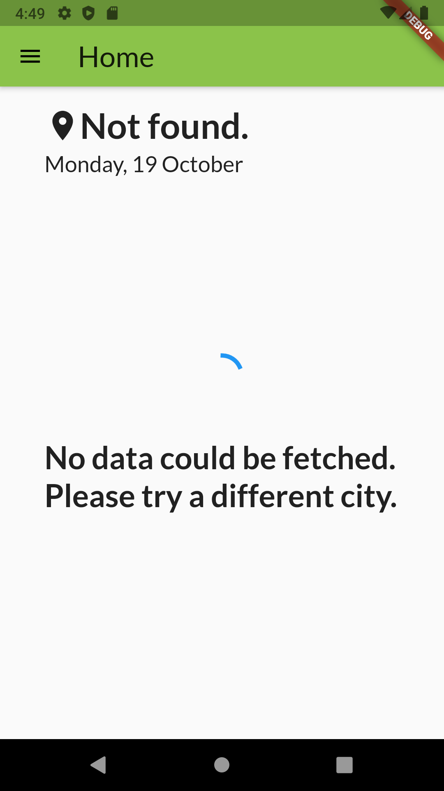
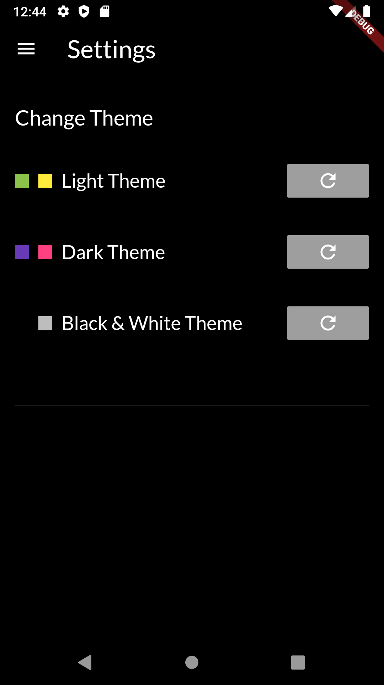

# flutter_app

A Flutter App for trying out different things and getting more familiar with Dart.

Overview:
- Homepage
- Settings
- Sources

## Homepage
Displays the current temperature and weather condition for a given city. The default is set to Karlsruhe, 
a different city can be set by pressing on the city name and typing in a valid city name.

Light Theme             |  Dark Theme
:-------------------------:|:-------------------------:
  |  

Black Theme             |  City not found
:-------------------------:|:-------------------------:
  |  

## Settings
There are three Themes for the app available. This page enables changing the theme. Default is the light theme.

Light Theme             |  Dark Theme                |  Black Theme
:-------------------------:|:-------------------------:|:-------------------------:
  |    |  

## Sources

### Tutorials

In addition to the official Flutter documentation, the following tutorials were used:

[How to make an API call in Flutter (REST API)](https://ayusch.com/how-to-make-an-api-call-in-flutter-rest-api/)

[Retrieve Json data in Flutter](https://medium.com/oceanize-geeks/retrieve-json-data-in-flutter-49c8fcd3e8c6)

[Dynamic theming with Flutter](https://medium.com/flutter-community/dynamic-theming-with-flutter-78681285d85f)

[Flutter Navigation Drawer from Basic to Custom Drawer](https://medium.com/flutterpub/flutter-navigation-drawer-from-basic-to-custom-drawer-66a60d27d687)

[Set background image to Flutter App](https://mightytechno.com/background-image-flutter/)

### Images
Sources of images that were used to display the current weather condition:

#### Unsplash

[Federico Respini](https://unsplash.com/photos/sYffw0LNr7s)

[eberhard grossgasteiger](https://unsplash.com/photos/pgTu7tevuro)

#### Pexels

[Lum3n](https://www.pexels.com/photo/green-pine-trees-covered-with-fogs-under-white-sky-during-daytime-167699/)

[Radu Andrei Razvan](https://www.pexels.com/photo/photography-of-trees-covered-with-snow-773594/)

[Jonas Kaiser](https://unsplash.com/photos/I621uimW8p0)

